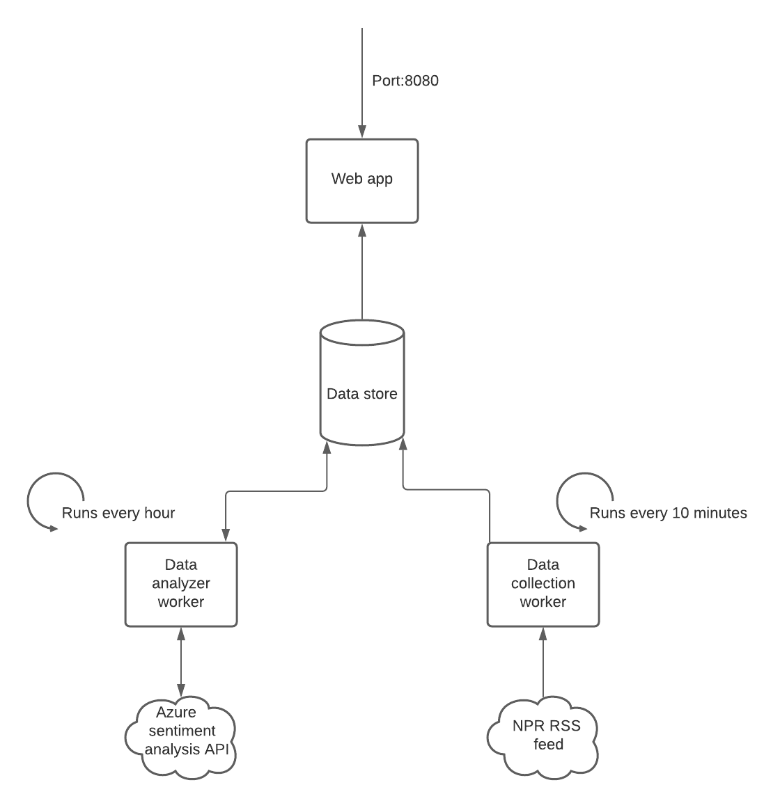

# NPR Sentiment

## Ann Marie Mahon

This is a [web app](https://npr-sentiment.herokuapp.com/) which collects articles from NPR, stores them in a database, performs sentiment analysis on the summary, and then makes this data available on the web app.  Testing is done using jest, and Heroku is used for hosting.

## Components

- Web app production environment: Hosted by Heroku, and available [here](https://npr-sentiment.herokuapp.com/).  Express is used for the web server, and the front end uses jquery.
- Data collection worker: Run on Heroku every 10 minutes, stores new articles in the database. (bin/parse_rss)
- Data analyzer: Articles which haven't been analyzed yet are run through the Microsoft Azure sentiment analysis tool each hour. (bin/analyze_sentiment)
- Unit tests: Implemented in Jest
- Data persistence: Data is stored in a Postgresql database hosted by Heroku.
- Internal API: The /articles endpoint (index.js) provides data about articles with sentiment scores in a JSON format, and is parsed by jquery on the web app. (index.html)
- External API: The sentiment analysis is run through the Azure Text Analytics client library. (bin/analyze_sentiment_functions.js)
- Continuous integration: Tests are run automatically using Github actions with each push.
- Continuous delivery: Commits to Main which pass all tests are automatically deployed to Heroku.

## Architecture diagram

